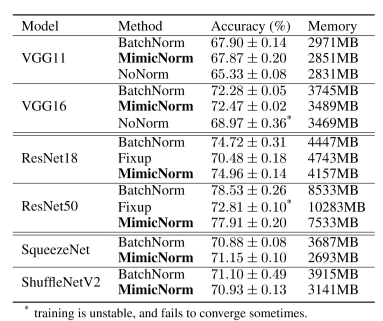
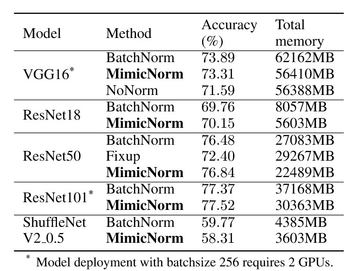

# MimicNorm: Weight mean and one last BN layer to replace BN layers  

## 1. Introduction

This project tests MimicNorm on Cifar and ImageNet dataset with various network structures, including VGGs, ResNets, efficient networks. MimicNorm achieves similar accuracy with less memory consumption. There are other benefits to replace BN layers. Please refer to [our paper](https://arxiv.org/abs/ )


## 2. Performance

### 2.1 Cifar-100



### 2.2 ImageNet




## 3. Dependencies

For experiments in cifar dataset, pytorch and torchvision is enough to run this project. As for imagenet, we use LMDB (https://github.com/xunge/pytorch_lmdb_imagenet) to accelerate IO thoughtout. pyarrows lmdb pandas of appropriate version should to be installed to use LMDB. If you don't use LMDB, a slight modified in `ImgageNet/data_loader.py` will work.

Here is an example of create environ **from scratch** with `anaconda`

```sh
# create conda env
conda create --name torch python=3.5
conda activate torch
# install pytorch
conda install pytorch==1.5.0 torchvision==0.6.0 cudatoolkit=10.2 -c pytorch

```


## 4. Train

### 4.1 Prepare data

Cifar dataset will automatically download at `Cifar/data`, and imagenet dataset (ILSVRC 2012) path definition is in `ImgageNet/data_loader.py`.


### 4.2 begin training


```bash
Our method:
python main.py --arch {$net}_cbn --weight mean -b 256
BN implement:
python main.py --arch {$net} -b 256
```

Some Key arguments:

- `--warm n`: warm-up learning rate in first `n` epochs
- `--resume {path}`: resume training from file `{path}`

Note:

Some network architectures have been implemented but not tested, like densenets for cifar. The valid architectures including: 

- cifar-100: vgg11, vgg13, vgg16, resnet18, resnet50, squeezenet, shufflenetv2
- imagenet: vgg11, vgg16, resnet18, resnet50, resnet101, shufflenetv2(modifying training strategy)


## Acknowledgement
1, This work builds on many excellent works, which include:

- [pytorch-cifar100](https://github.com/weiaicunzai/pytorch-cifar100) (cifar implementation)
- [ShuffleNetv2 in PyTorch](https://github.com/Randl/ShuffleNetV2-pytorch) (shufflenetv2 implementaion for imagenet dataset)

2, HUAWEI supports this project.


